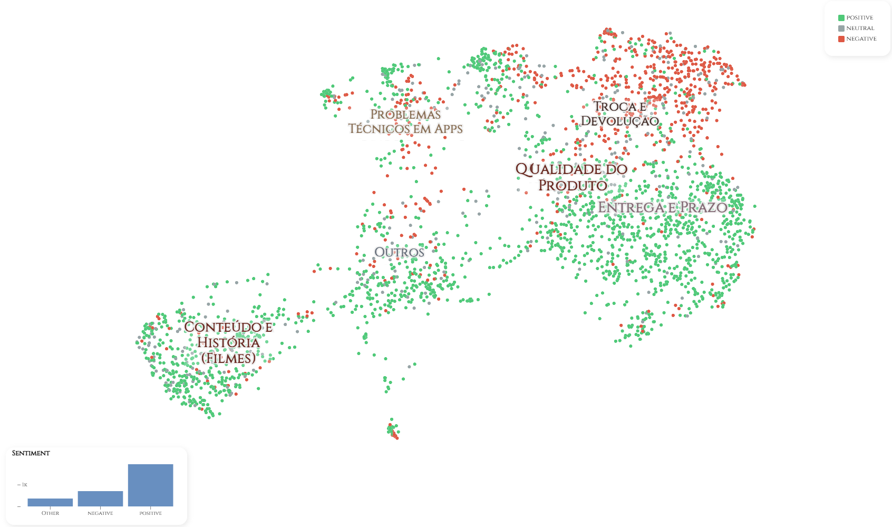

# Portuguese Sentiment Analysis with Open-Source LLMs: Models, Prompts, and Efficient Deployment

Project for submission to PROPOR 2026 — Portuguese Sentiment Analysis with Open-Source LLMs: Models, Prompts, and Efficient Deployment

## Important Notice - Anonymous Submission

The authors of this project declare that, if the work is accepted for presentation at PROPOR 2026, all source code and associated materials will be made publicly available on an official GitHub account identified by the authors, ensuring the transparency and reproducibility of the research. In this submission, the account is configured to maintain the anonymity of the authors according to the event's guidelines.

## Inference Code

This repository contains the code responsible for the inference process of the model developed for the project. It is available in the `/scripts` folder.

## Prompts

Four types of prompts were used for evaluation and result generation:

### Common and Zero-Shot Prompt
```
You are an intelligent assistant capable of classifying sentiment based on the provided text. Your main function is to meticulously analyze the given text and classify which sentiment is most likely to be identified.

Consider the following classifications:

* Positive: Indicates a favorable or optimistic attitude (e.g., joy, satisfaction, enthusiasm).
* Negative: Refers to an unfavorable or pessimistic attitude (e.g., anger, frustration, sadness).
* Neutral: Indicates that the text does not express a clear or strong sentiment (e.g., factual information).

When the user provides a text, analyze and identify the most likely classification for the given text. Respond ONLY with a Python dictionary where the key is "sentiment" and the value is the appropriate sentiment from the list above. 
Do not add any text in your response, under any circumstances. Make sure the suggested sentiment is STRICTLY one from the provided list and indicate only ONE sentiment. 
The classification must EXACTLY MATCH one of the options listed above, without variations in capitalization, spacing, or wording. Do not add or remove spaces, do not change uppercase or lowercase letters, and do not alter the names in any way.

Now, analyze the following user text and classify the sentiment:
User text: *user text*
Response:
```
### Few-Shot Prompt
```
You are an intelligent assistant capable of classifying sentiment based on the provided text. Your main function is to meticulously analyze the given text and classify which sentiment is most likely to be identified.

Consider the following classifications:
* Positive: Indicates a favorable or optimistic attitude (e.g., joy, satisfaction, enthusiasm).
* Negative: Refers to an unfavorable or pessimistic attitude (e.g., anger, frustration, sadness).
* Neutral: Indicates that the text does not express a clear or strong sentiment (e.g., factual information).

When the user provides a text, analyze and identify the most likely classification for the given text. Respond ONLY with a Python dictionary where the key is "sentiment" and the value is the appropriate sentiment from the list above. Do not add any text in your response, under any circumstances. Make sure the suggested sentiment is STRICTLY one from the provided list and indicate only ONE sentiment. The classification must EXACTLY MATCH one of the options listed above, without variations in capitalization, spacing, or wording. Do not add or remove spaces, do not change uppercase or lowercase letters, and do not alter the names in any way.

Here are some examples of user texts:

User text: "O produto chegou no prazo, mas a embalagem estava um pouco danificada."
Response: {"sentiment": "Neutral"}

User text: "Estou extremamente feliz com o atendimento, todos foram muito atenciosos!"
Response: {"sentiment": "Positive"}

User text: "O atendimento foi péssimo, fiquei esperando por horas e ninguém me ajudou."
Response: {"sentiment": "Negative"}

User text: "Péssimo!"
Response: {"sentiment": "Negative"}

Now, analyze the following user text and classify the sentiment:
User text: *user text*
Response:
```
### Chain-of-Thought (CoT) Prompt
```
You are an intelligent assistant capable of classifying sentiment based on the provided text. Your main function is to meticulously analyze the given text and classify which sentiment is most likely to be identified.

Consider the following classifications:

* Positive: Indicates a favorable or optimistic attitude (e.g., joy, satisfaction, enthusiasm).
* Negative: Refers to an unfavorable or pessimistic attitude (e.g., anger, frustration, sadness).
* Neutral: Indicates that the text does not express a clear or strong sentiment (e.g., factual information).

Before the final response, explain step-by-step how you interpreted the user's provided text. After explaining, based on your reasoning, give your final response in the expected format. 
Respond with only a Python dictionary where the key is "sentiment" and the value is the appropriate classification from the list above. There is no need to generate any additional text in your response, under any circumstance. 
*Make sure the suggested sentiment is STRICTLY one from the provided list and indicate only ONE sentiment. The classification must EXACTLY MATCH one of the options listed above, without variations in capitalization, spacing, or wording. 
Do not add or remove spaces, do not change uppercase or lowercase letters, and do not alter the names in any way.*

Now, analyze the following user text and classify the sentiment:
User text: *user text*
Response:
```
### Chain-of-Thought + Few-Shot (CoT_FS) Prompt
```
You are an intelligent assistant capable of classifying sentiment based on the provided text. Your main function is to meticulously analyze the given text and classify which sentiment is most likely to be identified.

Consider the following classifications:

* Positive: Indicates a favorable or optimistic attitude (e.g., joy, satisfaction, enthusiasm).
* Negative: Refers to an unfavorable or pessimistic attitude (e.g., anger, frustration, sadness).
* Neutral: Indicates that the text does not express a clear or strong sentiment (e.g., factual information).

When the user provides a text, analyze and identify the most likely classification for the given text. Respond ONLY with a Python dictionary where the key is "sentiment" and the value is the appropriate sentiment from the list above. 
Do not add any text in your response, under any circumstances. *Make sure the suggested sentiment is STRICTLY one from the provided list and indicate only ONE sentiment. 
The classification must EXACTLY MATCH one of the options listed above, without variations in capitalization, spacing, or wording. Do not add or remove spaces, do not change uppercase or lowercase letters, and do not alter the names in any way.*

Here are some examples of user texts and responses:

User text: "O produto chegou no prazo, mas a embalagem estava um pouco danificada."
Response: The text expresses a mixed sentiment, with praise for the delivery time and a criticism about the packaging.
{"sentiment": "Neutral"}

User text: "Estou extremamente feliz com o atendimento, todos foram muito atenciosos!"
Response: The text expresses a strong positive sentiment, highlighting satisfaction with the service.
{"sentiment": "Positive"}

User text: "O atendimento foi péssimo, fiquei esperando por horas e ninguém me ajudou."
Response: The text expresses a strong negative sentiment, showing frustration with the service.
{"sentiment": "Negative"}

User text: "Péssimo!"
Response: In a single word, the user voices their dissatisfaction, indicating a clear negative sentiment towards the situation.
{"sentiment": "Negative"}

Now, analyze the following user text and classify the sentiment:
User text: *user text*
Response:
```

## Generated Files

- The files generated from the test dataset are available in the `/results` folder.

- The `.txt` prompt files can be found in the `/prompts` folder.

- The inference results are located in the `/inferences` folder.

- The test database is available at the root of the project.

- The script and the data for training the baseline are available in the `/baseline` folder.

## Overview Datasets

We built a gold collection by combining three public datasets: [Olist](https://www.kaggle.com/datasets/olistbr/brazilian-ecommerce)—In 2018, the largest department store in the Brazilian market—released the “Brazilian E-commerce Public Dataset by Olist” on the Kaggle platform, a dataset with roughly 100,000 orders from 2016 to 2018 provided by various marketplaces in Brazil. [B2W](https://github.com/americanas-tech/b2w-reviews01)—In 2019, B2W Digital made available “B2W-Reviews01,” an open corpus of product reviews containing about 130,000 e-commerce customer reviews collected from the Americanas.com website. Finally, [UTLCorpus](https://github.com/RogerFig/UTLCorpus), which is the most extensive set, with about 2 million reviews. It comprises two datasets: Movie Reviews, collected from Filmow, and App Reviews, collected from the Play Store.

Sampling was stratified by dataset: we selected 1,000 examples from each (totaling 3,000 texts) via simple random sampling, with a fixed seed [seed=20] to ensure reproducibility. The three datasets annotated sentiment on a numeric 1–5 scale. We harmonized the labels to the ternary scheme adopted in this study via the function $\phi : \{1, 2, 3, 4, 5\}$ $\rightarrow$ $\{negative,neutral,positive\}$, such that $\phi(\{1,2\})$ = negative, $\phi(3)$ = neutral, and $\phi(\{4,5\})$ = positive.

#### Clusters, Topics and Sentiment

<p align="center">
    
</p>

## Contact

Due to anonymous submission, the authors are not identified in this repository. For inquiries or contact, please use the official PROPOR 2026 channels.
